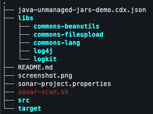
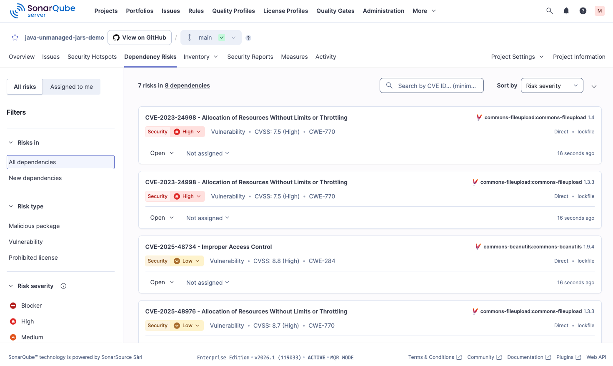

# SonarQube: SCA Scanning of Unmanaged Dependencies in Java Projects with Syft and SBOM Import

Sonar currently does not support SCA for unmanaged dependencies (jars) in Java projects. However, you can generate a Software Bill of Materials (SBOM) using tools like Syft and then analyze it with SonarQube.

This demo repo shows how to generate an SBOM for a Java project using Syft, and then scan it with SonarQube to identify vulnerabilities.

Take note of the unmanaged dependencies in folder `libs` as an example:



## Installation & Usage

Install Syft to generate the SBOM:

```
brew install syft
syft scan ./libs -o cyclonedx-json=java-unmanaged-jars-demo.cdx.json
```

Example is using brew on macOS, but you can find installation instructions for other platforms in the [Syft Documentation](https://github.com/anchore/syft).

Then adjust the `sonar-project.properties` file to include the generated SBOM:

```
sonar.exclusions=**/*
sonar.sca.sbomImportPaths=java-unmanaged-jars-demo.cdx.json
sonar.inclusions=java-unmanaged-jars-demo.cdx.json
```

Then scanning via `sonar-scanner`:

```
sonar-scanner \
  -Dsonar.projectKey=e-corp-demo_java-unmanaged-jars-demo_5d05ab5f-6ffa-487c-9977-c60e2b52d831 \
  -Dsonar.sources=. \
  -Dsonar.host.url=${SONARQUBE_URL} \
  -Dsonar.token=${SONARQUBE_TOKEN} \
  -Dsonar.verbose=true
```
Afterwards, you can view the vulnerabilities detected in the SonarQube dashboard.



## Questions & Contact

**Mathias Conradt**  
Security Solutions Engineer at Sonar  
https://www.linkedin.com/in/mathiasconradt/  
https://x.com/mathiasconradt